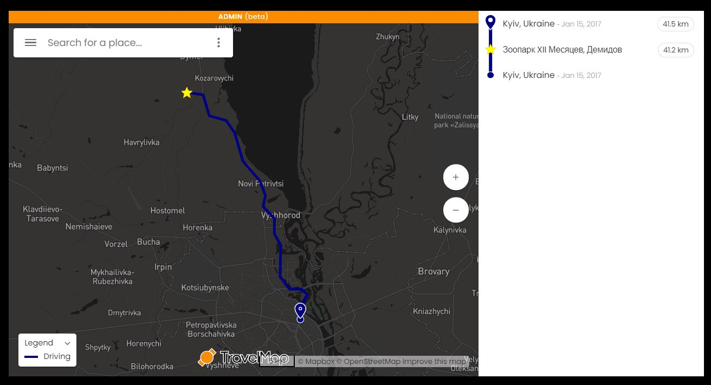
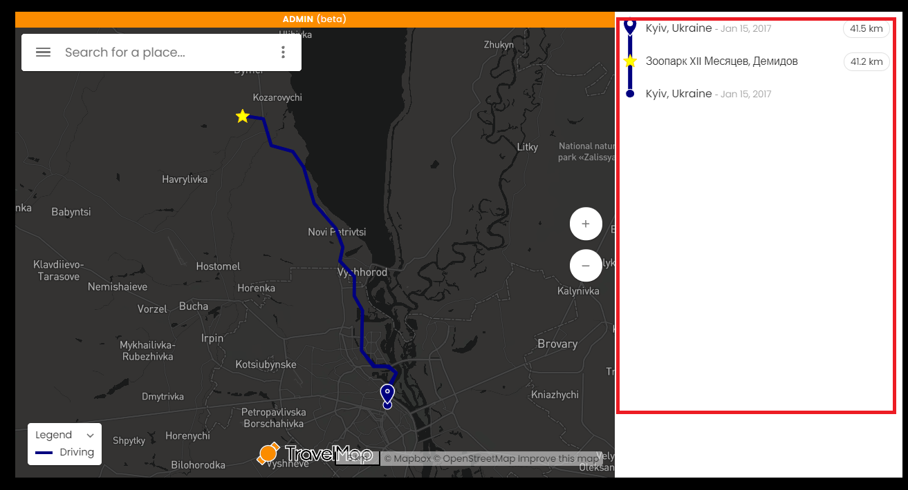
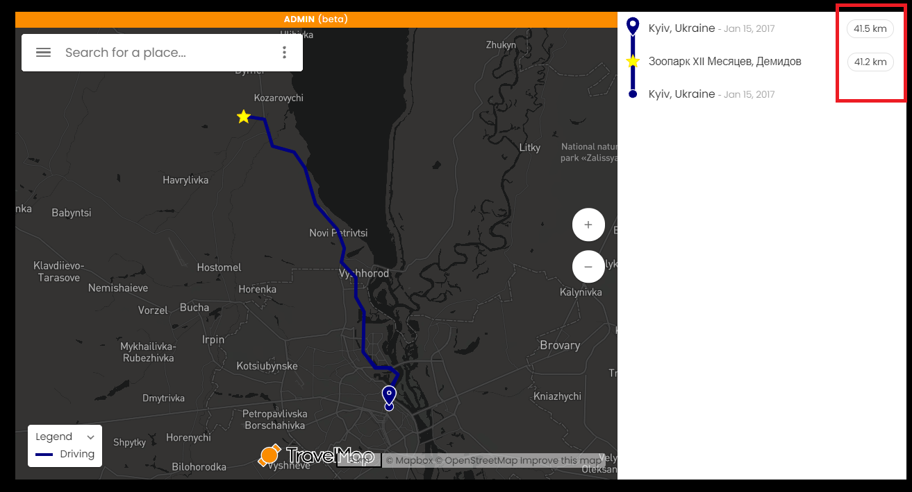
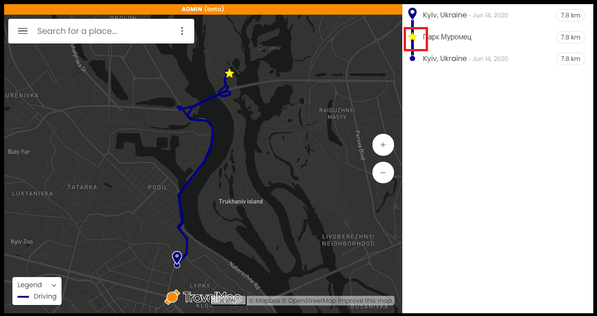
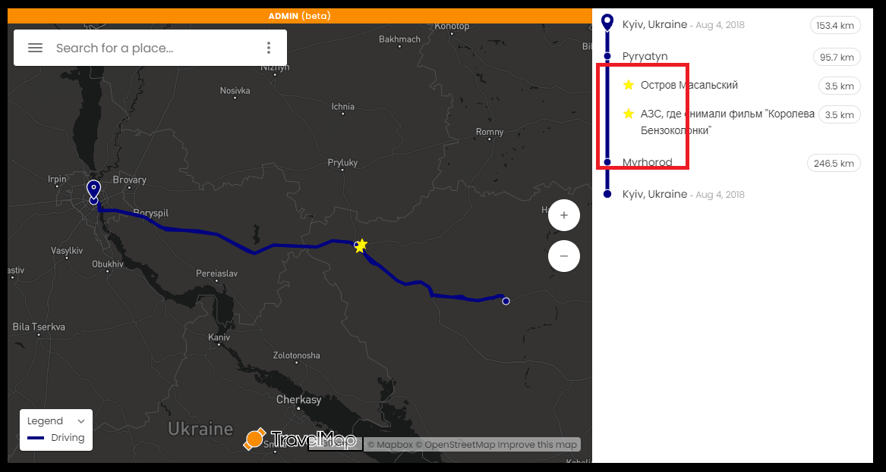
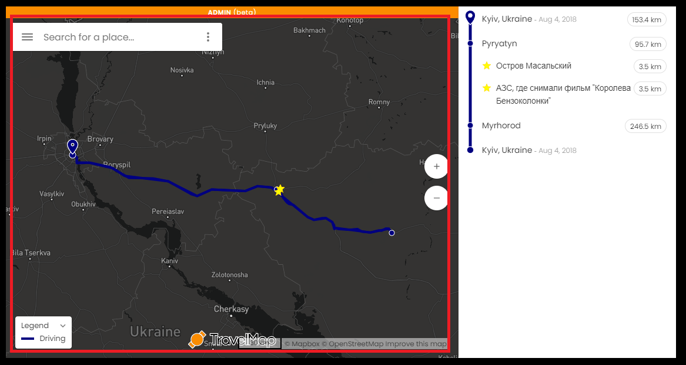
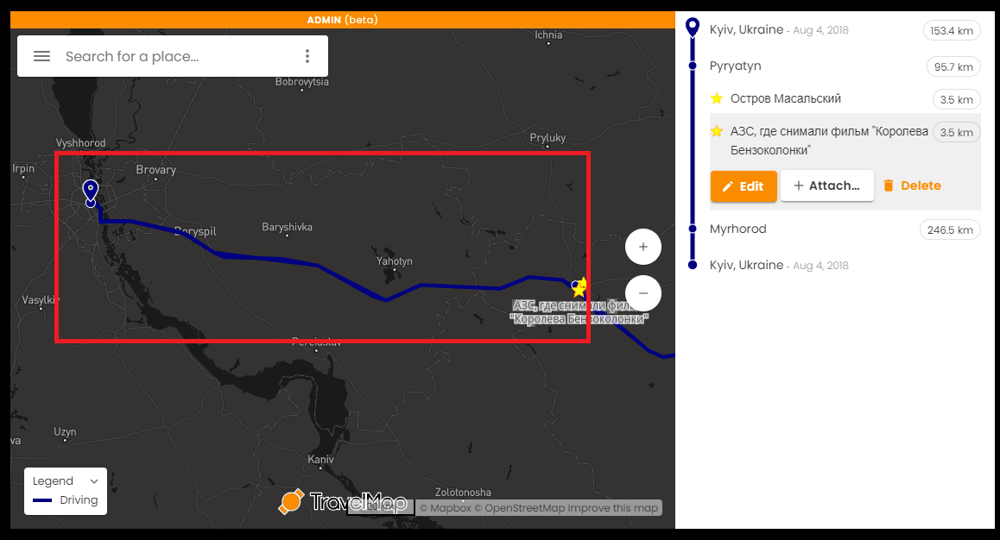
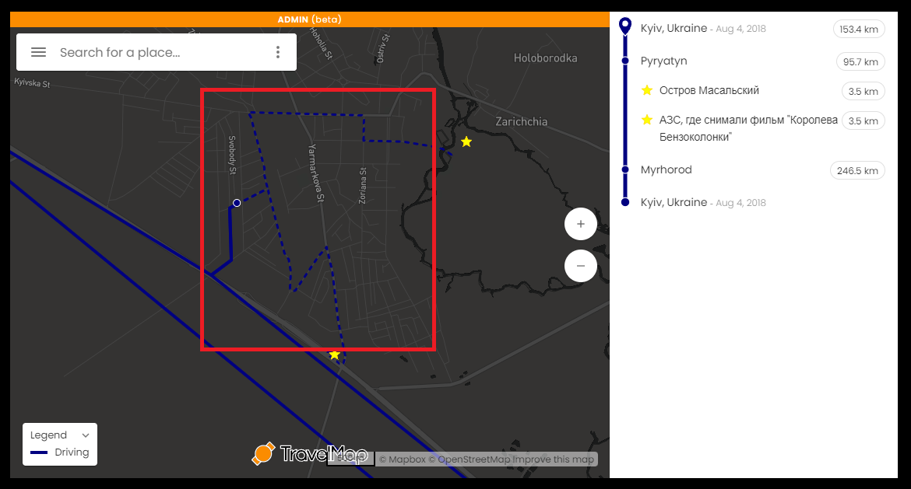
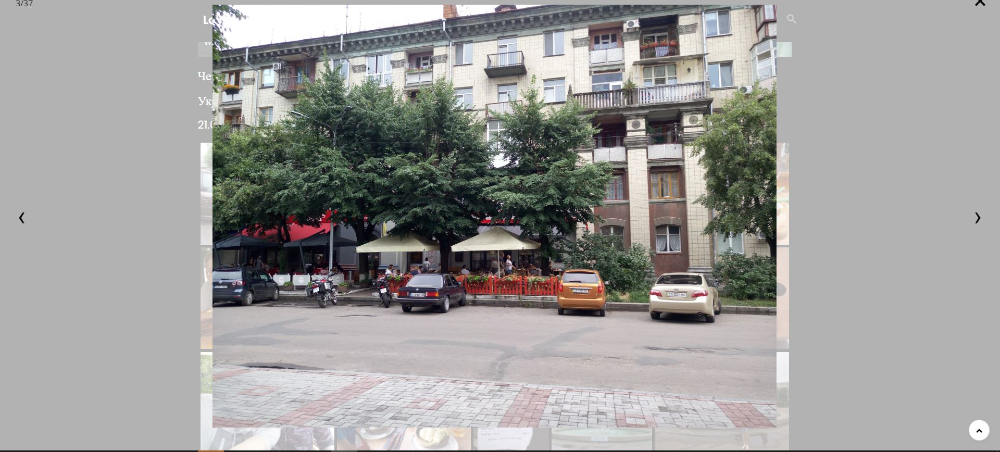

# Подорож - шаблонована сторінка

.png>)

де:

1. Header
2. Превью подорожі
3. Мапа
4. Стандартні блоки
   1. Другий стандартний блок
   2. Третій стандартний блок
   3. ....
5. Дата публікації
6. Footer&#x20;

Тобто 1 та 6 відносяться до сайту

2 - 5 відносяться до подорожі

1. Структура подорожі

1.0.1 Складається з

Прев'ю подорожі

1.1.1 Складається з

* Назва подорожі
* Країна, у вигляді прапору країни (входить у Прев'ю)
* Період часу (входить у Прев'ю)
* Прев'ю (картинка)

1.1.2 Назви подорожі - може складатися з

* Назви об'єкта подорожі
* міст, країн
* або мати іншу назву, яка описує саму подорож

1.1.2.1 Назва має бути унікальною у розрізі всіх подорожей

1.1.2.2 У назві ID подорожі не повинен бути присутнім

1.1.2.3 У назві дозволені символи:

* А-Я (символи укр-рус алфавіту)
* A-Z (символи латинського алфавіту)
* цифри
* ,-!?.

1.1.2.4 Якщо назва подорожі складається з перечня міст, то повинні бути відсутні старт і кінець подорожі (наприклад Київ-Канів-Тернопіль-Київ, має бути замінено на Канів-Тернопіль)

1.1.2.5 Назви країн кожної подорожі знаходяться у [Повний перелік всіх подорожей](https://github.com/scholokov/long-travel-2/wiki/3.1-%D0%9F%D0%BE%D0%B4%D0%BE%D1%80%D0%BE%D0%B6%D1%96.-%D0%9F%D0%B5%D1%80%D0%B5%D0%BB%D1%96%D0%BA)

1.1.3 Кількість прапорців відповідає кількості відвіданих країн

1.1.3.1 Відповідність відвіданих країн, знаходиться у [Повному переліку всіх подорожей](https://github.com/scholokov/long-travel-2/wiki/3.1-%D0%9F%D0%BE%D0%B4%D0%BE%D1%80%D0%BE%D0%B6%D1%96.-%D0%9F%D0%B5%D1%80%D0%B5%D0%BB%D1%96%D0%BA)

1.1.4 Формат дати:

`DD.MM.YYYY`

або

`DD.MM.YYYY - DD.MM.YYYY`

1.1.5 Прев'ю (картинка) - має бути унікальним у розрізі всіх подорожей

Мапа

### 1.2 Мапа

1.2.1.1 Загальна карта повинна бути присутня в кожній подорожі

1.2.1.2 У розрізі однієї подорожі має бути лише один блок з картою

#### 1.2.2. Маршрут подорожі

1.2.2.1 Біля кожної проміжної точки повинна бути вказана пройдена відстань від попередньої точки подорожі 

1.2.2.2 Початкова точка відображаєься кружком, кінцева - у вигляді краплі 

1.2.2.3 "Пам'ятки" відображаються "зірочками" 

1.2.2.4 Якщо маршрут йде відразу на "визначну пам'ятку", то вона знаходиться на лінії маршруту 

1.2.2.5 Якщо маршрут йде спочатку на проміжну точку (наприклад, готель чи місто), а вже від нього на пам'ятки, то вони знаходяться трохи з відступом від лінії маршруту 

1.2.2.5.0.1 Проміжні міста знаходяться на основній лінії

1.2.2.5.1 Також ця точка поєднується пунктирною лінією 

1.2.2.6 Якщо весь маршрут не виходить за межі Києва, має бути тільки одна точка 

1.2.2.7 Повинен бути присутнім активний елемент

1.2.2.7.1 Назва - "Відкрити подорож"

1.2.2.7.2 Після натискання повинна відкриватися відповідна сторінка з подорожжю

1.2.2.7.3 Лінка завжди веде на продакшн

1.2.2.7.4 Якщо на мапі лише одна точка, то кнопка має розташовуватись:

1.2.2.7.4.1 Якщо більше ніж одна точка на мапі, кнопка має розташовуватись знизу:

1.2.2.8 Повинна бути присутнім прев'ю фото

1.2.2.8.1 Прев'ю має збігатися з прев'ю на глобальній карті

1.2.2.8.2 Прев'ю має збігатися з прев'ю самої подорожі

1.2.2.8.3 Має бути лише одне прев'ю

1.2.2.8.4 Прев'ю може бути прив'язаним до любої точки

1.2.2.9 Мова

1.2.2.9.1 Всі назви країн мають бути на англійській мові

1.2.2.9.2 Назви міст мають бути на мові країн, до яких вони належать

1.2.2.9.3 Все інше на українській мові

1.2.2.10 Відображення

1.2.2.10.1 Країна та дата обов'язково відображається для першої та останньої точки

1.2.2.10.1 Якщо країна або дата збігається з наступною точкою (зверху) то вона не відображається

#### 1.2.3. Карта

1.2.3.1 Крапки на карті з'єднуються суцільною лінією 

1.2.3.2 Пам'ятки, які прив'язані до якоїсь проміжної точки (і на "Легенді" мають відступ), а не маршруту, сполучаються з проміжною точкою, вказаною на схемі (місто або готель) пунктирними лініями 

Стандартний блок(и)

### 1.3 Стандартний блок(и)

1.3.1 Складається з

* Header (Прев'ю) 
* Body 

1.3.1.1 Header (Прев'ю) складається з

* Назва подорожі \*
* Місто або Місто, Область
* Країна, у вигляді прапору \*
* Проміжок часу \*
* Прев'ю \*

\*-Блоки, які обов'язково повинні бути присутні

1.3.1.1.1 Якщо є блок "дорога" він повинен мати наступний формат: "Дорога: ХХХ - YYY", де XXX - початкова точка, YYY - кінцева точка. Також блок дорога повинна містити один або кілька прапорів країн, залежно від кількості країн цього маршруту. Розташування прапора на протилежному боці від точок подорожі. (детальніше написано у [Стандартних блоках](https://github.com/scholokov/long-travel-2/wiki/4.3-%D0%9F%D0%BE%D0%B4%D0%BE%D1%80%D0%BE%D0%B6.-%D0%A1%D1%82%D0%B0%D0%BD%D0%B4%D0%B0%D1%80%D1%82%D0%BD%D1%96-%D0%B1%D0%BB%D0%BE%D0%BA%D0%B8))

1.3.1.2 Body складається з

* Галерея з фото та відео (пункт 1.3.3)
* Youtube відео/галерея (пункт 1.3.4)
* Текстовий опис

але, як мінімум - один з цих блоків

1.3.2 Стандартних блоків може бути необмежена кількість, але не менше одного

#### 1.3.3 Галерея з фото та відео

1.3.3.1 Загальне

1.3.3.1.1 Фотографії повинні підвантажуватись не всі відразу, а тільки ті, що наближаються до видимої області (Lazy Loading)

1.3.3.2. Галерея

1.3.3.2.1 Галерея складається з прев'ю фото

1.3.3.2.2 Натисніть на прев'ю фото - відображається повноцінне фото (LightBox)

1.3.3.2.3 Тип фотогалереї повинен бути Mosaic:

для того щоб перевірити, відкриваємо дев тулс

шукаємо div. У ньмоу ключ layout повинен мати значення "mosaic"

приклади:

правильна: layout=mosaic

неправильна: layout=random 

неправильна: layout=square 

1.3.3.2.4 Перша галерея має завантажуватися одразу

1.3.3.2.5 Всі наступні галереї НЕ мають завантажуватися одразу

1.3.3.2.5.1 Замість незавантаженої галереї має відображатися кнопка "Відобразити галерею"

1.3.3.2.5.2 Після натискання на кнопку "Відобразити галерею" має завантажиись та відобразиться відповідна галерея

1.3.3.3. LightBox

1.3.3.3.1 LightBox повинен закриватися за ESC

1.3.3.3.2 Повинен бути хрестик для закриття LightBox

1.3.3.3.2 Повинні бути стрілки для прогортання фото

1.3.3.4. Відео

1.3.3.4.1 Галерея може містити фото та відео

1.3.3.4.2 Відео має програватися після натискання на кнопку Play

1.3.3.5. Механізм роботи прев'ю та фото:

* На сервері знаходиться фото вихідної якості
* Для побудови галереї клієнту видається фото "достатньої" якості. Тобто якості рівного або меншого від початкового, залежно від параметрів клієнта. Тобто галерея зазвичай складається з менш якісних фото (тобто так звані прев'ю), ніж вихідні
* При виведенні LightBox порівнюються розміри прев'ю і розміри LighBox, якщо розміри в LightBox значно більше ніж прев'ю, запитуються якісніші фото, аж до фото вихідної якості

#### 1.3.4 Youtube Галереї

1.3.4.1. Youtube відео/відео галерея.

1.3.4.1.1 Містить лише відео.

1.3.4.1.2 Якщо містить більше одного відео перетворюється на галерею

1.3.4.1.3 Якщо відео належить до "дороги", то підпис має формат: Початковий пункт виїзду - кінцевий пункт приїзду

наприклад:

`2020.01.30 Київ-Одеса 01`

де "порядковий номер" необов'язковий параметр

1.3.4.1.3.0 Якщо існує більше ніж 2 точки, то формат буде той самий

наприклад:

`2020.01.30 Київ-Умань-Одеса 01`

1.3.4.1.3.1.0 Якщо у подорожі лише одне місце має бути наступний формат:

`Дата Подія Номер (якщо більше одного відео)`

`2020.01.30 Межигірья 01`

`2020.01.30 Пляж 01`

1.3.4.1.3.1 В інших випадках підпис має формат:

`Дата Місце Подія Номер (якщо більше одного відео)`

`2020.01.30 San Marino Пляж 01`

де "порядковий номер" необов'язковий параметр

1.3.4.1.3.2 Назва відео лише українською мовою

1.3.4.1.3.2.1 Назви Країн та міст поза Україною - на англійській мові

1.3.4.1.3.3 Формат дати зворотній - YYYY.MM.DD, наприклад 2020.01.30

1.3.4.1.4 Якщо в відео галереї знаходиться декілька відео та вони мають різні дати, у назві має бути присутня лише сама рання дата (а не діапазон дат)

1.3.4.1.5 Ім'я та прізвище автора мають бути на анг мові

Дата публікації

### 1.4 Дата публікації

1.4.1 Формат DD.MM.YYYY

1.4.2 Дата публікації повинна відповідати стартовій даті подорожі

## 2. Загальні вимоги

2.1 Назва міст, областей, країн має бути мовою країни, до якої належить місто

2.2 URL

URL повинен відповідати ID подорожі

наприклад:

https://long-travel.live/20180721\_cherkassy/

де 20180721\_cherkassy - ID
