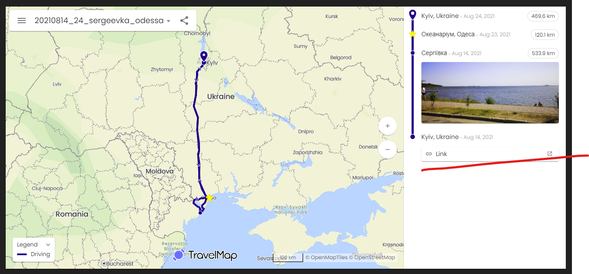

# Мапа

| Дизайн | [https://www.figma.com/file/mh7iDnG6ec7yiC0SCGad7L/Long-Travel?node-id=986%3A6\&mode=dev](https://www.figma.com/file/mh7iDnG6ec7yiC0SCGad7L/Long-Travel?node-id=986%3A6\&mode=dev) |
| ------ | ---------------------------------------------------------------------------------------------------------------------------------------------------------------------------------- |

<table><thead><tr><th width="126">#</th><th>Назва</th><th>Коментарі</th></tr></thead><tbody><tr><td><strong>1.2</strong></td><td><strong>Мапа</strong></td><td>

</td></tr><tr><td>1.2.0</td><td>Розташування блоку Мапа</td><td></td></tr><tr><td>1.2.1.1</td><td>Загальна карта повинна бути присутня в кожній подорожі</td><td></td></tr><tr><td>1.2.1.2</td><td>У розрізі однієї подорожі має бути лише один блок з картою</td><td></td></tr><tr><td><strong>1.2.2.</strong></td><td><strong>Маршрут подорожі</strong></td><td></td></tr><tr><td>1.2.2.0</td><td>Сортування точок: знизу старіші, зверху новіші</td><td></td></tr><tr><td>1.2.2.0.1</td><td>Кожна точка має містити назву міста, або назву місцевості (якщо поза містом)</td><td></td></tr><tr><td>1.2.2.1 </td><td>Біля кожної проміжної точки повинна бути вказана пройдена відстань від попередньої точки подорожі </td><td></td></tr><tr><td>1.2.2.1.1</td><td>Відстань не вказується лише у останньої точки</td><td></td></tr><tr><td>1.2.2.2</td><td>Початкова точка відображаєься кружком, кінцева - у вигляді краплі </td><td></td></tr><tr><td>1.2.2.3</td><td>"Пам'ятки" відображаються "зірочками"</td><td></td></tr><tr><td>1.2.2.4</td><td>Якщо маршрут йде відразу на "визначну пам'ятку", то вона знаходиться на лінії маршруту </td><td></td></tr><tr><td>1.2.2.5</td><td>Якщо маршрут йде спочатку на проміжну точку (наприклад, готель чи місто), а вже від нього на пам'ятки, то вони знаходяться трохи з відступом від лінії маршруту </td><td></td></tr><tr><td>1.2.2.5.0.1</td><td>Проміжні міста знаходяться на основній лінії</td><td></td></tr><tr><td>1.2.2.5.1</td><td>Також ця точка поєднується пунктирною лінією </td><td>

</td></tr><tr><td>1.2.2.6</td><td>Якщо весь маршрут не виходить за межі Києва, має бути тільки одна точка </td><td></td></tr><tr><td>1.2.2.7 </td><td>Повинен бути присутнім активний елемент</td><td></td></tr><tr><td>1.2.2.7.1</td><td>Назва - "Відкрити подорож"</td><td></td></tr><tr><td>1.2.2.7.2</td><td>Після натискання повинна відкриватися відповідна сторінка з подорожжю</td><td></td></tr><tr><td>1.2.2.7.3</td><td> Посилання завжди веде на продакшн середовище</td><td>long-travel.live</td></tr><tr><td>1.2.2.7.4</td><td>Якщо на мапі лише одна точка, то кнопка має розташовуватись:</td><td>

</td></tr><tr><td>1.2.2.7.4.1</td><td>Якщо більше ніж одна точка на мапі, кнопка має розташовуватись знизу:</td><td>

</td></tr><tr><td>1.2.2.8</td><td>Повинна бути присутнім прев'ю фото</td><td></td></tr><tr><td>1.2.2.8.1</td><td>Прев'ю має збігатися з прев'ю на глобальній карті</td><td></td></tr><tr><td>1.2.2.8.2</td><td>Прев'ю має збігатися з прев'ю самої подорожі</td><td>

</td></tr><tr><td>1.2.2.8.3</td><td>Має бути лише одне прев'ю</td><td></td></tr><tr><td>1.2.2.8.4</td><td>Прев'ю може бути прив'язаним до любої точки</td><td></td></tr><tr><td>1.2.2.9</td><td>Мова</td><td></td></tr><tr><td>1.2.2.9.1</td><td>Всі назви країн мають бути на англійській мові</td><td></td></tr><tr><td>1.2.2.9.2</td><td>Назви міст мають бути на мові країн, до яких вони належать</td><td></td></tr><tr><td>1.2.2.9.3</td><td>Все інше на українській мові</td><td></td></tr><tr><td>1.2.2.10</td><td>Відображення Дати</td><td></td></tr><tr><td>1.2.2.10.1</td><td>Країна та дата обов'язково відображається для першої та останньої точки</td><td></td></tr><tr><td>1.2.2.10.2</td><td>Якщо країна або дата збігається з наступною точкою (зверху) то Дата не відображається</td><td></td></tr><tr><td>1.2.2.10.3</td><td>Якщо країна або дата НЕ збігається з наступною точкою (зверху) то Дата має відображатися</td><td></td></tr><tr><td><strong>1.2.3.</strong></td><td><strong>Карта</strong></td><td></td></tr><tr><td>1.2.3.1</td><td>Крапки на карті з'єднуються суцільною лінією </td><td></td></tr><tr><td>1.2.3.2</td><td>Пам'ятки, які прив'язані до якоїсь проміжної точки (і на "Легенді" мають відступ), а не маршруту, сполучаються з проміжною точкою, вказаною на схемі (місто або готель) пунктирними лініями </td><td></td></tr><tr><td>1.2.3</td><td>Список, що випадає з картами має бути відсутнім</td><td>

</td></tr></tbody></table>

